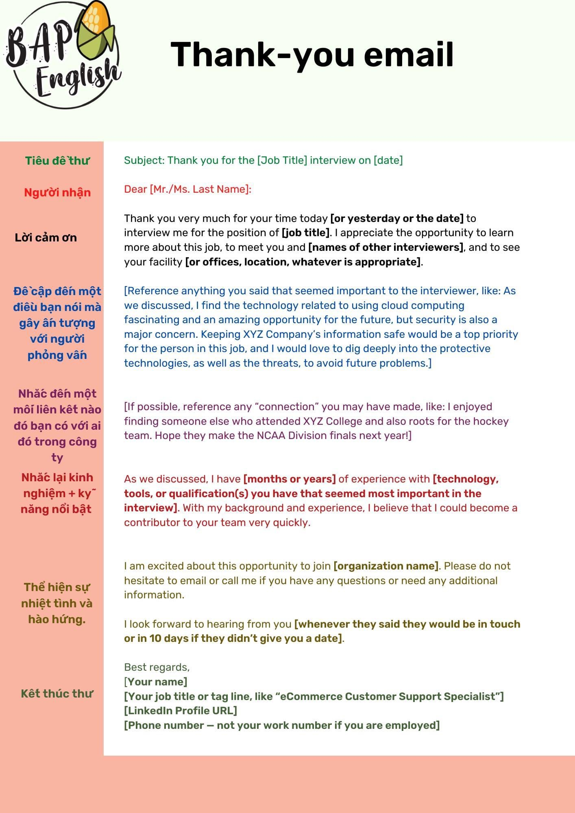

Hi mọi người,
Câu 1: “Hello! I'm a rising junior/sophomore at [School Name] and is looking into applying to SDE Intern positions at [Company Name]. If you could spare a minute, can I just ask you a few questions about the process? I would greatly appreciate it, thank you!”
Sau khi người ta trả lời:
Câu 2: “Thanks a lot. It may be too much of a request but I will shoot my shot here.
[Company’s name] is my top priority company for an internship this year and I would be really grateful if you could help me with a referral (of course after you considered that I’m suitable). You can find all my information on LinkedIn.
Happy to chat more if you have the time. Looking forward to hearing from you.”

## Email
Good day Ms...,
I would like to thank you for everything you have done during this interview journey.
Thank you so much for your kind support and fast notification.
Even I was not selected but I have learnt a lot and also I pretty enjoyed the whole process.
I wish you all the best and hopefully to see you in person soon.
Have a lovely working day!
