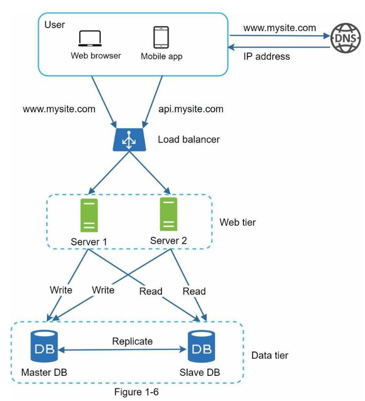

# Key concepts
**SQL i**s a language - **MySQL** is a relational database management system (RDBMS)
> **Data inconsistent** -> Data is said that is inconsistent if multi-copies of the same data don’t match each other.
> **Data redundancy** -> The same data is present in many places (files, tables…).
> **Data Integrity** → make sure **Accuracy + Consistency**.

## Why do we need DBMS?
- Data inconsistent + Data redundancy
- Authorize data
- Data access
- Difficult concurrency access
- support backup and recovery

## Entity, Table and Relationship
**ENTITY** 
> Entity is a logical concept of the relational database model. 
> Entity resides in a table, it is a single set of information.
- An entity is an object in the real world with an independent existence that can be differentiated from other objects. An entity might be:
- An object with physical existence (e.g., a lecturer, a student, a car): Employee, Project.
- An object with conceptual existence (e.g., a course, a job, a position).

**TABLE** is used to express it, but there is a slight difference. (express both Entity and Relations).

**RELATIONSHIP** can have its own attributes.
> `work_on`: start_date, employee_id, project_id

One-to-Many relationships = Tree Structured data

**Document model** is appropriate when
- 1-n - tree
- No relationships between records

But when the relationships between records become more complex -> Graph model will be the best choice.

**Relational database**
**Document database** target use cases where data comes in self-contained document and relationships one document and another are rare
**Graph databases** go in the opposite direction, targeting use cases when anything potentially related to everything

# SQL - No SQL
**What is the mean of relation?** → Instead of saving all Infos into a table → let’s split it into multiple tables that have relations together.

| SQL        	| NoSQL            	|
|------------	|------------------	|
| Relational Model	| Non - relational - Document Model	|
| Table      	| Collection       	|
| Row        	| Document         	|
| Column     	| Field            	|

## 1. SQL - Relational database
[[SQL]]
### Benefits 
> vertical scalability: table based - row-oriented DB
- Best for complicated queries.
- We need to ensure ACID compliance—data needs to be consistent.
- Data is structured and unchanging.
- Easy to represent Many-To-Many relationships
	- Join is powerful
	- Reduce duplication data by reference.
### Drawbacks
It does not scale well horizontally: split data across many smaller machines → can have a huge impact on performance querying data.

When SQL slow
- processing a complex query on a large dataset.

## 2. NoSQL - Document database
[[NoSQL]]
> Relationship: One-To-Many
> **Hierarchical model**
### Benefits 
> Horizontal scalability

Non-relational databases might be the right choice if:
• Your application requires super-low latency.  
• Your data are unstructured, or you do not have any relational data.  
• You only need to serialize and deserialize data (JSON, XML, YAML, etc.). • You need to store a massive amount of data.
### Types
NoSQL has 4 distinct types: **Key-value**, **document stores**, **graph**, and **column-oriented DB**.
> Excellent performance with **simple queries**
### Detail
- It is designed for **horizontal scaling** → splitting data across many smaller machines is easy.
- **Don’t have a table** - don’t need to predefine scheme - can save anything
    - If you need to store a massive amount of data
- **For scaling**: you only need to _serialize and deserialize_ data JSON, XML, YAML, etc.
    → Making the most of cloud computing and storage. Because cloud-based storage is an excellent cost-saving solution but requires data to be easily spread across multiple servers to scale up.
- **Optimize Write operator:** It stores large volumes of data that have **little to no structure**.
    - No need for **constraints**, **unstructured** data → no need to **check type/constraints** when writing data.
    - Add new columns and fields without impacting your existing rows or the application’s performance.
    → Rapid development
- **Low-latency → Optimize Read operator:**
    - but it is explicitly designed **to handle simple low-level queries**:
        - Put all your data into big tables and use just the most basic queries
    - when compared to SQL:
        - No need to join to find the whole value of an entity
    - For **Column database** type**: self-indexing on columns** (because it is the columnar DB) → no need to have an extra disk to store indexing.

### NoSQL Drawbacks
- cost rollback
- Not built for update - transaction - ACID (Concurrency)
- Read time is slower (select column-name): find all values of one field in the collection.
- Relations are not implicit
- **JOIN is hard**.
- - SQL is not fault-tolerant.
- Duplicated data
	- Don's support refer directly data.
	- In relational db, it is normal to refer to rows in other tables by ID
	- In NOSQL, join are not needed for one-to-many tree, and support join is often weak.
- NoSQL works well with one to many relationships but it made many-to-many relationships difficult and didn't support join.
	- 


Some reasons to use NoSQL
- JSON model - hierarchical model
- The scheme is **easily changeable**
- Build for scaling.
- Build for metrics/ analytic/ aggregation.
- No need to join to find the whole value of an entity.
- NoSQL databases are designed specifically to handle **simple low-level queries.**

## Relational Versus Document
- Fault-tolerance properties
- Handling Concurrency
- Data model

Data model
- If data in your app has document like structure (tree, one-to-many) -> good for NoSQL
- It's not possible to say in general which data models to simpler app code, it depends on the kind of relationship the exist between data items.
- For higher interconnected data -> relational model is more approriate.
- 


# Database replication
## Benefits
- Reduce latency: keep data geographically close to user
- Increase availability (HA): if one machine have failed, it has no effect to another.
- Increase READ throughput: to scale out the number of machine that can serve read queries
## Challenge
- Handling changes to replicated data

### Algorithms
- Single-leader
- Multi-leader
- Leaderless

### Problem
- Eventual consistency
	- Read your write
	- monotonic read
- 
Data partitions: → inconsistent in sync to all slaves
## Two-way replication
- **Synchronous**
	- The **primary** node **waits** for acknowledgments from **secondary nodes** about updating the data. After receiving acknowledgment from all secondary nodes, the primary node reports success to the client
- **Asynchronous**
	- the primary node doesn’t wait for the acknowledgment from the secondary nodes and reports success to the client after updating itself
**- Semi-Sync**
	- there will have 1 sync follower and all the remaining follower are async

![[sequence-diagram-replication.png]]


##  Data replication models
- Single leader or primary-secondary replication (Master-Slave)
- Multi-leader replication
- Peer-to-peer or leaderless replication

### 1. Single leader or primary-secondary replication (Master-Slave)
> **When**
- the workload is read-heavy.
- → come with inconsistency if we use asynchronous replication
In case of failure of the primary node → a secondary node can be appointed as a primary node.

> **Methods:** There are many different replication methods in primary-secondary replication
- **Statement-based replication**
	- the primary node saves all statements that it executes, like insert, delete, update, and so on, and sends them to the secondary nodes to perform. This type of replication was used in MySQL before version 5.1.
- **Write-ahead log (WAL) shipping**
	- the primary node saves the query before executing it in a log file known as a write-ahead log file. It then uses these logs to copy the data onto the secondary nodes.
	- **Problem:** it needs to define data at a very low level.
- **Logical (row-based) log replication**
	- all secondary nodes replicate the actual data changes

### 2. Multi-Leader replication
- Give better performance and scalability than a single leader but it has a significant disadvantage.
- All primary nodes deal with the write requests.
- Modify the same data.

### 3. Peer-to-peer or Leaderless replication
> **Database replication** can be used in many database management systems, usually with a **master**/**slave** relationship between the original (master - write/update only) and the copies (slaves read-only)


## Master and slave
### Why do we need a master's node?
A system can use quorum (master) to ensure **data consistency** between replicas.
All reads/writes are not considered successful until a majority of nodes participating in the operation.
**But it is low availability**, anytime, the system needs to ensure that at least a majority of replicas are up and available.




Let us take a look at the design: • A user gets the IP address of the **load balancer** from **DNS**. • A user connects the load balancer with this IP address. • The HTTP request is routed to either Server 1 or Server 2. • A web server reads user data from a **slave** database. • A web server routes any data-modifying operations to the **master** database. This includes writing, updating, and deleting operations.

# **Connection pooling**
> strategy to keep database connections open and reuse
- because connecting to a database can be an expensive task
→ some of the clients did not close the connection and all the connections in use and our client is not able to create a new connection to the database
→ That’s why we’re getting the 500 error
→ This happens because we don’t configure the database properly for our needs
→ Visit the database config and increase the pool size

```
A-id 1 -> B-id 2
begin
- update money-A - 10 where id = 1
- update money-B + 10 where id = 2
end

B -> A
begin
- update money-B - 10 where id = 2
- update money-A + 10 where id = 1
end

A-id 1 -> B-id 2
begin
- update money-A - 10 where id = 1
- update money-B + 10 where id = 2
end

B -> A
begin
- update money-A + 10 where id = 1
- update money-B - 10 where id = 2
end
```

## Leader failure: Failover
> **Failover** is a process to choose a new leader and reconfigure clients to send their write to the new leader and other followers need to start consuming data from the new leader

Steps:
1. Determining that the leader has failed
2. Choosing a new leader: - consensus problem
	- election process (chosen by the majority of the remaining replicas)
	- or the new leader could be appointed  from previous elected controller mode
3. Reconfiguring the system to use the new leader

Problem:
- 2 nodes both believe that they are leader -> split brain -> data would be lost or corrupted.
	- -> some systems have a mechanism to shut down one node if two leaders are detected.
- If Async replication is used -> the new leader may not have received all the writes from the old leader before it failed -> LOSE DURABLE
# Reference
- [NoSQL introduction](https://www.youtube.com/watch?v=xQnIN9bW0og)
- [Is NoSQL faster than SQL](https://www.quora.com/Is-NoSQL-faster-than-SQL/answer/Lee-Pearce-14?ch=10&oid=54673455&share=78db4951&srid=hZxTWk&target_type=answer)
