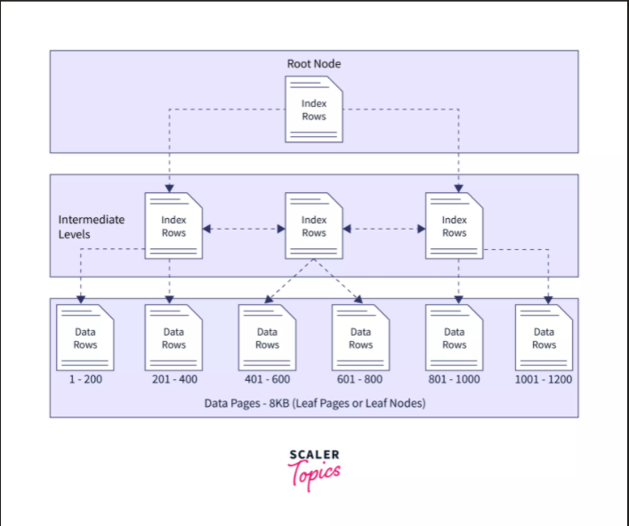

# Reference
- [Clustered Indexing](https://use-the-index-luke.com/sql/clustering)
- [Deep look DB Indexing](https://www.freecodecamp.org/news/database-indexing-at-a-glance-bb50809d48bd/?fbclid=IwAR3gjMn8obtAzayqOc-KlEqyrnotxz2WRSjyy3_C_xKFDKGBGio-LHEOtwU)
- [Composite Index](https://sqlhints.com/tag/composite-index-used-only-if-leading-column-is-in-the-where-clause/)

# Note
- **Indexing** → care about the distinct value of the column
	- more duplicated value → low performance
- Index affects to **IS_NULL** operator
	- when this column is not indexed → needs a table full scan to find null values.

# Overview?
## Why we need indexes for Database tables
### Benefits
- Speed up searching.
- Indexing helps in faster sorting and grouping of records.

### Drawbacks
- **Additional disk space**
	- **The clustered index** doesn’t take any extra space as it stores the physical order of the table records in the DB.
	- **Non-Clustered Index** needs extra disk space.
- **Slower data modification** 
	- update record in the **clustered index**

# Terminology
## What is logical and physical?


## B-Tree
[[B Tree, B+ Tree]]
**B-tree** is a type of tree data structure that contains 2 things namely: the Index Key and its corresponding disk address.
- Index Key refers to a certain disk address
- disk further contains rows or tuples of data


# Keys → uniquely identifies each row
## 1. Super key
> Is a set of one or more attributes that can be used to identify rows in a table.
> **All super keys can’t be primary keys**

The super key attribute can be NULL, which means its values can be null.

|        	|                   	|                                                                                                                                       |
|--------	|-------------------	|--------------------------------------------------------------------------------------------------------------------------------------	|
| ID     	| UNIQUE, NOT_NULL  	| cause it's unique so any combination with other attributes should be unique → all combination with ID is **super key**: {ID}, {ID,NAME} 	|
| Email  	| UNIQUE,NULL     	    | the same with **{ ID }** because it is unique                                                                                             |
| Name   	| NOT_UNIQUE, NULL 	    | **{ Name }** When it is alone it can **NOT** be a super key                                                                                   |
| Salary 	| NOT_UNIQUE        	| the same as **{ Name }**                                                                                                                  |


## 2. Candidate key (NOT NULL + UNIQUE)
> is a **subset** of a super key where the key contains **NO redundant** attribute.
> **Any key of candidate keys can be used as a Primary key.**

- **NOT NULL** + **UNIQUE.**
- Every table must have at least a single candidate key.
- A table can have multiple candidate keys but only one primary key

**NO REDUNDANT** means:
- **{ ID, EMAIL }** is NOT a candidate key because both ID and EMAIL are unique so we just use one of them to use as a candidate key
- **{ ID }** → is a candidate key
- **{ EMAIL }** → is a candidate key.

## 3. Primary key (NOT NULL + UNIQUE)
> A column is called PK which uniquely identifies each row in the table. - main advantage: fast access

- **NOT NULL** + **UNIQUE.**
- A **PK** may consist of a **single** column or **multiple** columns according to the data set → that ensure all values stored in the column will be unique.
- A table can have only **ONE** primary key.
- It can be dropped after creating. `ALTER TABLE students DROP PRIMARY KEY`

## 4. Unique key
> is a single or combination of fields.

It is similar to PK but has a slight difference:
- The unique key allows **more than one** per table
- **Don’t support auto-increment**
- We can store **NULL** value in the unique key column, but only **one NULL is allowed**

## 5. Foreign key - referencing key
> It is used to link one or more tables together.

## 6. Composite key - don’t support auto-increment
> is a combination of 2 or more columns, It may be a candidate key or primary key.
> **If this composite key is set as a primary key → It must be not NULL + must UNIQUE**
> In case it is not PK → it can be null + duplicate

# Overview
- The index is nothing but a data structure that **store the values for a specific column** in a table (an index is created on a column table).
- Improve the speed of data retrieval operations.
- With DML operations, indices are updated, so write operations are quite costly with indexes. 
   - The more indices you have, the greater the cost. 
   - Indexes are used to make READ operations faster.
   - So if you have a system that is **written-heavy** but not **read-heavy**, think hard about whether you need an index or not.
- **Cardinality** is IMPORTANT
   - **Cardinality** means the **number of distinct values in a column**.
   - If you create an index in a column that has low cardinality, that’s not going to be beneficial since the index should reduce search space. Low cardinality does not significantly reduce search space.


## Indexing Question
### 1. What would happen without an index? - FULL Table Scan
So, every row up until the last row must be searched – which means thousands of rows in this scenario will have to be examined by the database to find the rows with the name ‘Abc’. This is what is called a ==FULL table scan==.

### 2. What exactly is inside a database index?
A database index is created on a column in a table, and the index stores the values in that specific column.
But, it is important to understand that a database index **does not store the values in the other columns** of the same table.
For example, if we create an index on the Employee_Name column, this means that the Employee_Age and Employee_Address column values are not also stored in the index.
If we did just store all the other columns in the index, then it would be just like creating another copy of the entire table – which would take up way too much space and would be very inefficient.

### 3. How does a database know when to use an index?
When a query like `SELECT * FROM Employee WHERE Employee_Name = ‘Abc’` is run, the database will check to see if there is an index on the column(s) being queried. 
Assuming the **Employee_Name** column does have an index created on it, the database will have to decide whether it actually makes sense to use the index to find the values being searched – because there are some scenarios where it is actually less efficient to use the database index, and more efficient just to scan the entire table.

### 4. How do Index stores?
An index is a data structure (most commonly a B- tree) that stores the values for a specific column in a table.
[B Tree visualization](https://www.cs.usfca.edu/~galles/visualization/BPlusTree.html)

| Type                   	|                                   	|                                                      	|
|------------------------	|-----------------------------------	|------------------------------------------------------	|
| B Tree - Balanced Tree 	| Search, Delete, Insert  O(log n) 	| support search by range                              	|
| Hash Table             	| Search, Delete, Insert  O(1)     	| cannot search by range, only look up key value pairs 	|

# Clustered and Non-Clustered index
> A clustered index is a table where the data for the rows are stored

**Each table has only one clustered-index** - that stores row data
- When we define PK → InnoDB use it as the clustered index
- If we don’t define a PK → It will use the first **UNIQUE** index in this table
- If a table has no PK or suitable UNIQUE index → It will generate a hidden clustered index: GEN_CLUST_INDEX.

Each record in a secondary index contains the PK columns for the row as well as the columns specified for the secondary index
All InnoDB indexes are B-trees where the index records are stored in the leaf pages of the tree.
- The Default size of an index page is 16KB [MySQL::InnoDB Page Size](https://dev.mysql.com/doc/refman/8.0/en/innodb-parameters.html#sysvar_innodb_page_size)
The MEMORY storage engine (known as HEAP) supports both HASH and BTREE index
→ creates special purpose tables with contents that are stored in memory.
In this engine, there
- HASH for equality operator (only available on MEMORY engine)
- BTREE for range operator (both in MEMORY and InnoDB)


# Example

|ID - PK|Name|Age|Column 4|
|---|---|---|---|
|1|a1|23||
|2|a2|12||
|3|a3|43||
|4|a4|21||
|5|a5|11||

**Constraints**
- Add **primary key- PK** to column **ID. —>** `InnoDB` uses it as the **clustered index**
- Add a **secondary index** to column **Name.**

**Clustered Index:**
In BTree →Build based on **PK** (là column ID) → each node will store all data of a row
Id = 1 -> Name, Age, Column 4
Id = 2 -> Name, Age, Column 4

**Secondary index**: indexing by column of **Name: only store** the **column Name’s value**
Name: a1 -> pk: 1
Name: a5 -> pk: 5
`Select * from table where name = a3`

1. step 1 : dùng secondary index -> tìm ra name = a3 -> lấy ra pk = 3 ->
2. step 2: qua chỗ lưu clustered index -> tìm pk = 3 -> trả ra row

==1 lần query Innodb chỉ dùng 1 index== (trừ **Union** **Operator**)
`Select * from table where name = tuan and age = 35;`

**InnoDB** nó chỉ dùng được 1 index, nếu bạn đánh index riêng cho name và age, thì nó hoặc sài name, hoặc sài age.


# Questions
### When we need to create A composite index (name and age)?
Lúc lưu, lưu những cái cái theo name -> lưu theo age
`Select * from where name = tuan and age = 12;`
> **The order of the composite index doesn’t matter when selecting**

[Does the order of columns in composite index is matter](https://sqlhints.com/2017/10/01/does-the-order-of-columns-in-a-composite-index-matters-tip-3-sql-server-101-performance-tuning-tips-and-tricks/#:~:text=The) 
order of the columns of the index in it.

When running a SQL statement → it will create a plan execution.
- This plan will find the optimized index that can be used for this query.
- For the composite index, it will check the condition that is registered as a composite index in DB not followed by the order condition in the query.

```sql
--Create a Non-clustered index on 3 columns
CREATE INDEX index_name ON table_name(c1,c2,c3);

--------- ZERO COST
// SAME order --> 0% cost
SELECT * FROM table_name
WHERE c1 = 'a' AND c2 = 'b' AND c3 = 'c';

// DIFF order  --> 0% cost
SELECT * FROM table_name
WHERE c2 = 'b' AND c3 = 'c' AND c1 = 'a';

// only c1 --> 0% cost
SELECT * FROM table_name
WHERE c1 = 'a';
----------

---------- CANNOT use this index
// only c2 or only c3 --> 100% cost
SELECT * FROM table_name
WHERE c2 = 'b';

// without c1 --> 100% cost
SELECT * FROM table_name
WHERE c2='b';
SELECT * FROM table_name
WHERE c2='b' AND c3='c';
```

### Why do we use composite indices? Why not define multiple secondary indices on the columns we are interested in?

_**MySQL uses only one index per table per query except for UNION**._ (In a UNION, each logical query is run separately, and the results are merged.) So defining multiple indices on multiple columns does not guarantee those indices will be used even if they are part of the query.

MySQL maintains something called index statistics which helps MySQL infer what the data looks like in the system. Index statistics is a generalization though, but based on this metadata, MySQL decides which index is appropriate for the current query.

### How to identify if you need a composite index
- Analyze your queries first. If you see certain fields appearing together in many queries, you may consider creating a composite index.
- If you are creating an index in `col1` & a composite index in (`col1`, `col2`), then only the composite index should be fine. `col1` alone can be served by the composite index itself since it’s a left-side prefix of the index.
- Consider cardinality. If columns used in the composite index end up having high cardinality together, they are a good candidate for the composite index.

The secondary index is also maintained in the BTree and it is sorted as per the key on which the index was created.

**Disadvantages**:
- With **DML** operations like UPDATE (**DELETE/ INSERT)**: the secondary index also needs to be updated so that the copy of the PK column can be deleted/inserted.
    - → In such cases, the existence of lots of secondary indexes can create issues
- More secondary keys mean a greater number of duplicate copies of the PK column value.
We can delete a Primary index by dropping the PK
- It is a costly operation when we have already a secondary index depending on a primary index.

### Difference between the **Clustered Index** and the **Non-Clustered Index**?
1. A Clustered Index physically stores the data of the table in the order of the keys values and the data resorted every time whenever a new value is inserted or a value is updated in the column on which it is defined, whereas a non-clustered index creates a separate list of key values (or creates a table of pointers) that points towards the location of the data in the data pages.
2. Non-clustered indexes don’t define the physical ordering of data, but logical ordering.
3. **A Clustered Index requires no separate storage than table storage**. It forces the rows to be stored sorted on the index key whereas a non-clustered index requires separate storage than the table storage to store the index information.
4. A table with a Clustered Index is called a Clustered Table. Its rows are stored in a B-Tree structure sorted whereas a table without any clustered indexes is called a non-clustered table. Its rows are stored in a heap structure unsorted.
5. In a Clustered Index, the leaf node contains the actual data whereas in a non-clustered index, the leaf node contains the pointer to the data rows of the table.
Both indexes have the same physical structure and are stored in the MySQL server database as a B-Tree structure.

### What is a Non-Clustered Index? - known as a secondary index
The indexes other than PRIMARY indexes (clustered indexes) are called non-clustered indexes.
The non-clustered index and table data are both stored in different places.
![[compare-cluster-non-cluster-index.png]]
