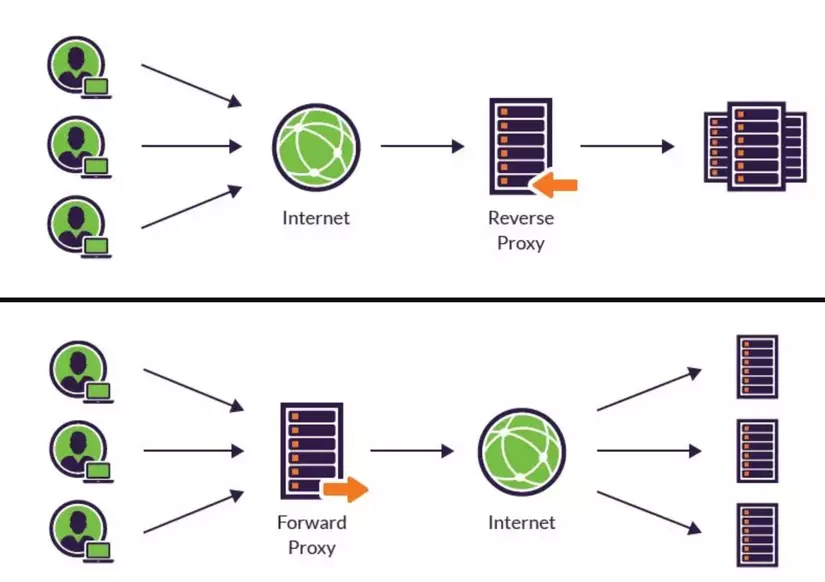

### Basic

# Step 1:
> Rate Limit, DNS, Proxy, Reverse proxy, Load Balancing, CDN, Blob storage,Vertical Scaling, horizontal scaling.

## What should I do when a user spam requests?
At that time, we need to have a rate limiting. We can restrict the number of requests that a client can make to a server within a period of time.
AWS provides several services that can be used for rate limiting, depending on the specific needs of your application: API Gateway, CloudFront, AWS WAF (firewall), AWS Lambda.

## where do static files(html, css) store?
If we store it in database so each client's request will need to go to database that make the server cannot handle.
That's why we need to have another server such as BLOG storage (S3, Azure Blog,...) and then use a CDN service (Cloudfare, AWS Cloudfront, GCP Cloud) to deliver static files for **load reduction** on the main server.

## How do we scale the main server?
### Vertical scaling - scale up
- Increase the power of server: add more rams, upgrade CPU,...

### Horizontal scaling - scale out
- Increase the capacity of a system by adding more machines (nodes)

> When scaling out, how does the client know which servers they should communicate with?

The **Load balancer** is responsible for distributing incoming requests from clients to the available servers in a way that ensure optimal resource utilization and performance.
Or for more simpler, we just need to have **a reversed proxy** to handle.
(Actually reversed proxy can be used as a LB).
LB and reverse proxy are 2 distinct technologies that can be used together and to improve performance and scalability of web app. They have several different purposes and different capacities.

After that, we have a system like below.

keywords: Cache, In-Memory Cache, Distribution Cache, Round Robin, consistent hashing, LRU (Least Recent Use) , FIFO(First in First out) LFU(Least Frequently Use), Redis, HA

## Bottlenecks at Database
> When the number of requests from servers is high, the system may still experience bottlenecks at the database levels.

### 1. Data not change frequently
--> We need to have a cache database
Instead of getting data from database, server will read from cache first
-> improve read speed because cache data is stored in memory.
There're 2 types of caching:
1. **In-Memory Cache:** 
	- Stores in RAM of a single server or node in a network.
	- Problem is when RAM capacity has been exceeded so we need to use cache eviction algorithms: LRU, FIFO, LFU.
2. **Distribution Cache** 
	- Cache is share across multiple servers or nodes in networks.
	- But if the cache server is shutdown, we would loss all cache data, so to make the system **high availability** (HA), the cache should be replicated to multiple nodes (like master-slave strategy,...).

We even combine 2 kind of caching and in multiple levels: 
Flow: get Cache from In-memory -> cache miss -> Get from Distribution - > Miss -> Get from DB.

### 2. Upgrade Database - Master & Slave
#### a. Master & Slave
#### b. Sharding

- Celerity problem: unbalanced condition -> using hash to reduce problem.
- 

[Đĩ Nghiện Code Thuật Vấn Đáp cách xây dựng một website hàng triệu người dùng P3 (viblo.asia)](https://viblo.asia/p/di-nghien-code-thuat-van-dap-cach-xay-dung-mot-website-hang-trieu-nguoi-dung-p3-bJzKmArBK9N)